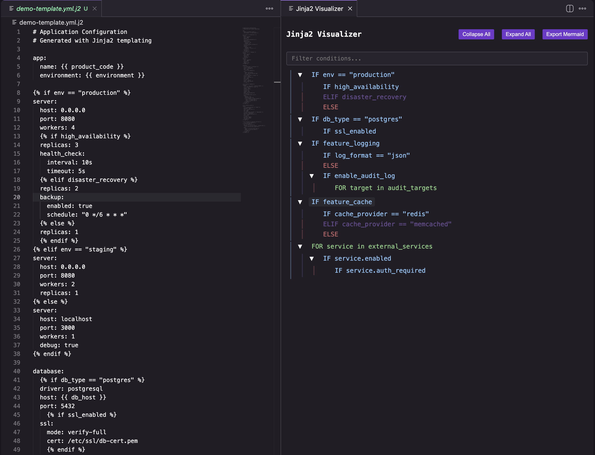
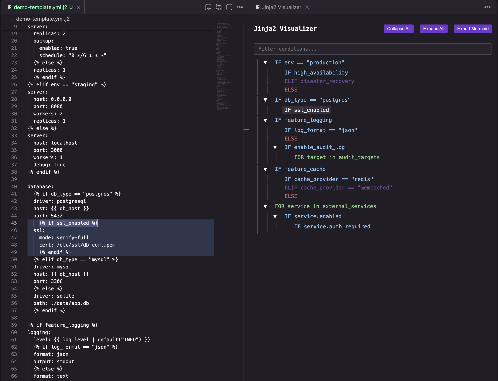
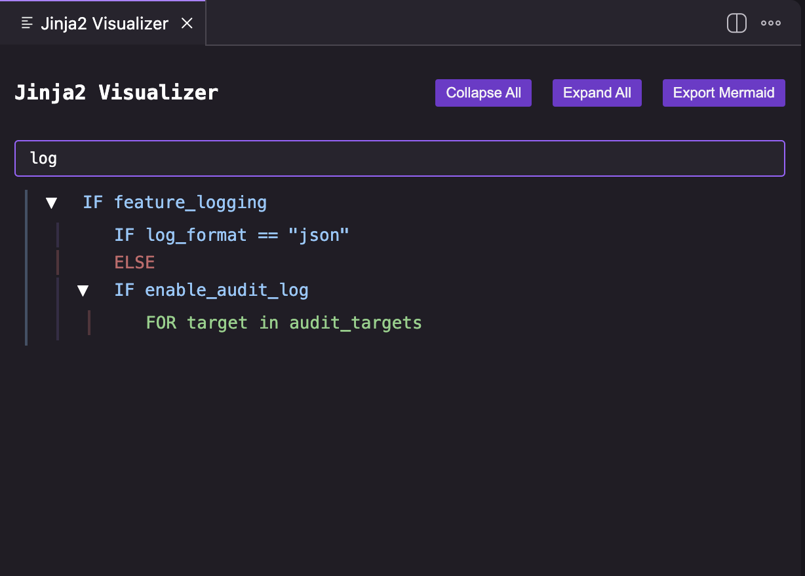

# Jinja2 Visualizer

A VS Code / Kiro extension that helps you visualize and navigate complex nested Jinja2 conditional blocks in your templates without modifying the source file.



## Features

- 🔍 **Visual tree view** of nested if/elif/else/for blocks
- 🎯 **Click to navigate** — jump directly to any block in your template
- 🔦 **Block highlighting** — clicking a node highlights the entire block boundary in the editor
- 🔎 **Search/filter** — type to filter the tree by condition text
- 📂 **Collapse/Expand all** — bulk toggle for large templates
- 🎨 **Theme-aware colors** — adapts to dark, light, and custom VS Code themes
- 🖥️ **Auto-detect** — preview icon appears automatically when a file contains Jinja2 syntax
- 📊 **Export to Mermaid** — generate a Mermaid diagram of your template logic
- ✨ **Non-invasive** — view logic structure without modifying your files

Works with VS Code, Kiro, and other VS Code-based editors.

### Block Highlighting



### Search & Filter



## Usage

1. Open any file containing Jinja2 syntax (`.html`, `.j2`, `.jinja2`, `.yml`, `.cfg`, etc.)
2. Click the preview icon in the top-right of the editor tab, or:
3. Open the Command Palette (`Ctrl+Shift+P` / `Cmd+Shift+P`) → **"Jinja2: Open Visualizer"**

### Example

For a template with nested conditionals like:
```jinja2

  
    timeout: 30
  
    timeout: 20
  
    timeout: 10
  

  timeout: 5

```

The visualizer displays:
```
IF env == "production"
  IF feature_x
  ELIF feature_y
  ELSE
ELSE
```

## Requirements

- VS Code 1.75.0+ or Kiro (any version)
- No additional dependencies required

## Installation

Install from VSIX:
1. Download `jinja2-visualizer-0.0.3.vsix`
2. `Cmd+Shift+P` → **"Extensions: Install from VSIX..."**
3. Select the downloaded file

## Known Issues

- Currently only supports `if/elif/else/for` blocks. Other Jinja2 constructs (macros, blocks, etc.) are not visualized.
- Inline if expressions are not included in the visualization.

## Contributing

Found a bug or have a feature request? Please open an issue on the [GitHub repository](https://github.com/mannubhai1/jinja2visualiser/issues).

## License

[MIT](https://github.com/mannubhai1/jinja2visualiser/blob/main/LICENSE)
